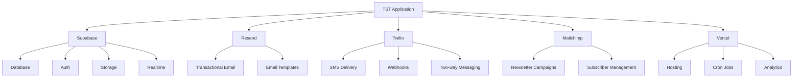

# TST Runtime Touchpoints & External Dependencies

*Generated on 2025-01-09*

This document catalogs all runtime touchpoints with external services, environment variables, webhooks, and third-party integrations in the TST codebase.

## Table of Contents

1. [Environment Variables Contract](#environment-variables-contract)
2. [External Service Integrations](#external-service-integrations)
3. [Webhook Endpoints](#webhook-endpoints)
4. [Cron Jobs & Automated Workflows](#cron-jobs--automated-workflows)
5. [Database Connections](#database-connections)
6. [API Route Dependencies](#api-route-dependencies)
7. [Client-Side Integrations](#client-side-integrations)
8. [Security & Authentication](#security--authentication)

---

## Environment Variables Contract

### Critical Production Variables
```bash
# Database & Backend
NEXT_PUBLIC_SUPABASE_URL           # Main Supabase project URL
SUPABASE_SERVICE_ROLE_KEY          # Server-side admin key
NEXT_PUBLIC_SUPABASE_ANON_KEY      # Client-side public key
NEXT_PUBLIC_SUPABASE_PROJECT_ID    # For image optimization
SUPABASE_URL                       # Alternate URL reference (sitemap)

# Communication Services  
RESEND_API_KEY                     # Transactional email service
RESEND_FROM                        # Default sender email address
TWILIO_ACCOUNT_SID                 # SMS service account ID
TWILIO_AUTH_TOKEN                  # SMS service auth token
TWILIO_PHONE_NUMBER                # SMS sender phone number
TWILIO_MESSAGING_SERVICE_SID       # Messaging service identifier

# External Integrations
MAILCHIMP_API_KEY                  # Newsletter campaign management
MAILCHIMP_SERVER_PREFIX            # API server region
MAILCHIMP_AUDIENCE_ID              # Default mailing list

# Application Configuration
NEXT_PUBLIC_SITE_URL               # Base URL for links and redirects
CRON_SECRET                        # Security token for cron endpoints
CLAUDE_API_KEY                     # AI conversation features
NEXT_PUBLIC_ENABLE_ANALYTICS       # Analytics toggle flag

# Development & Testing
SUPABASE_DB_PASSWORD               # Local development database
NEXT_PUBLIC_ENABLE_DEBUG           # Debug logging toggle
```

### Environment Usage Analysis
- **29 API routes** depend on `SUPABASE_SERVICE_ROLE_KEY`
- **52 locations** reference Supabase environment variables
- **15 routes** require `RESEND_API_KEY` for email functionality
- **8 components** use Twilio environment variables for SMS
- **2 cron jobs** require `CRON_SECRET` for security

---

## External Service Integrations

### 1. Supabase (Primary Database & Auth)
**Purpose**: PostgreSQL database, authentication, file storage

**Integration Points**:
- **Database Clients**: 
  - `createClient()` - Server-side admin operations (29 routes)
  - `createClientComponentClient()` - Client-side authenticated operations (18 components)
  - `createServerComponentClient()` - SSR authenticated operations (2 pages)

**Key Usage**:
```typescript
// Server-side (API routes)
const supabase = createClient(
  process.env.NEXT_PUBLIC_SUPABASE_URL!,
  process.env.SUPABASE_SERVICE_ROLE_KEY!
);

// Client-side (React components)  
const supabase = createClientComponentClient();
```

**Dependent Features**:
- All appointment booking and management
- Contact and lead tracking
- Blog post storage and management
- User authentication and authorization
- File uploads and image storage
- Real-time notifications
- Newsletter subscriber management

### 2. Resend (Transactional Email)
**Purpose**: Automated email delivery for appointments, confirmations, reminders

**Integration Points**:
- **15 API routes** send transactional emails
- **Email Templates**: Custom HTML/text templates in `/lib/custom-email-templates.ts`
- **Retry Logic**: Automatic retry on delivery failures

**Key Usage**:
```typescript
const resend = new Resend(process.env.RESEND_API_KEY);
await resend.emails.send({
  from: process.env.RESEND_FROM,
  to: recipientEmail,
  subject: emailSubject,
  html: customTemplate
});
```

**Email Types**:
- Appointment confirmations and reminders
- Reschedule/cancellation notifications  
- Contact form submissions
- Lead nurturing sequences
- Newsletter notifications

### 3. Twilio (SMS Communications)
**Purpose**: Automated SMS reminders and two-way messaging

**Integration Points**:
- **Client**: `/lib/twilio/client.ts` - Main Twilio interface
- **Webhooks**: `/api/twilio/webhook/route.ts` - Incoming message processing
- **Workflows**: `/lib/twilio/workflow-triggers.ts` - Automated sequences
- **Delivery Tracking**: `/lib/twilio/delivery-tracking.ts` - Message status updates

**Key Features**:
- Appointment reminders (24h, 2h before)
- Questionnaire follow-up sequences
- Two-way conversation support
- Delivery status tracking
- Failed message retry logic

### 4. Mailchimp (Newsletter Campaigns)
**Purpose**: Newsletter management and marketing campaigns

**Integration Points**:
- **API Integration**: Newsletter subscription management
- **Campaign Creation**: Automated newsletter-to-campaign conversion
- **Subscriber Management**: Audience management and segmentation

**Usage**:
- Blog post promotion campaigns
- Subscriber list management
- Marketing automation workflows

---

## Webhook Endpoints

### 1. Twilio SMS Webhook
**Endpoint**: `POST /api/twilio/webhook`
**Purpose**: Process incoming SMS messages and delivery receipts

**Security**: 
- Twilio signature validation
- Request body verification
- Rate limiting and error handling

**Processing**:
- Incoming message routing to conversation system
- Delivery status updates for sent messages
- Failed message retry triggers
- Contact record updates

**Data Flow**:
```
Twilio → Webhook → Message Processing → Database Update → Response Generation
```

### 2. Supabase Realtime (Implicit)
**Purpose**: Real-time database change notifications
**Usage**: Dashboard notifications, live data updates

---

## Cron Jobs & Automated Workflows

### 1. Appointment Cleanup (`/api/cron/cleanup-appointments`)
**Schedule**: Every 2 hours (Vercel cron)
**Purpose**: Clean up past appointments and update contact statuses

**Process**:
- Identify appointments older than 24 hours
- Update contact records with completion status  
- Trigger follow-up workflows
- Archive completed sessions

### 2. Workflow Processing (`/api/cron/process-workflows`)
**Schedule**: Every 6 hours (Vercel cron)  
**Purpose**: Execute automated communication workflows

**Process**:
- Questionnaire reminder sequences
- Appointment reminder scheduling
- Lead nurturing campaigns
- Failed message retry attempts

**Security**: Both cron endpoints require `CRON_SECRET` validation

---

## Database Connections

### Primary Connection Pattern
```typescript
// Server-side operations (full admin access)
const supabase = createClient(
  process.env.NEXT_PUBLIC_SUPABASE_URL!,
  process.env.SUPABASE_SERVICE_ROLE_KEY!
);

// Client-side operations (user-scoped access)
const supabase = createClientComponentClient();
```

### Key Database Tables (inferred from queries)
- **contacts**: Lead and client information
- **appointments**: Session scheduling and status
- **notifications**: Dashboard alerts and reminders  
- **posts**: Blog content with engagement tracking
- **newsletters**: Campaign content and subscriber management
- **conversations**: SMS conversation history
- **message_templates**: Reusable communication templates

### Database Security
- Row Level Security (RLS) enabled
- Service role bypass for admin operations
- User-scoped access for client operations
- Secure token-based appointment management

---

## API Route Dependencies

### High-Dependency Routes (Critical)
1. **`/api/graphql`** - Central GraphQL endpoint
   - Supabase admin access
   - Complex data operations
   - Real-time subscriptions

2. **`/api/appointment/*`** - Booking system core
   - Supabase database operations
   - Resend email notifications
   - UUID-based security tokens

3. **`/api/twilio/webhook`** - SMS processing
   - Twilio webhook validation
   - Supabase conversation storage
   - Automated response generation

### Medium-Dependency Routes
- `/api/send-appointment-emails` - Email automation
- `/api/newsletter/*` - Campaign management  
- `/api/contact/*` - Lead processing
- `/api/dashboard/notifications` - Admin alerts

### External API Dependencies Summary
| Service | Routes | Purpose | Criticality |
|---------|--------|---------|------------|
| Supabase | 29 | Database operations | **Critical** |
| Resend | 15 | Email delivery | **Critical** |
| Twilio | 8 | SMS communications | **High** |
| Mailchimp | 3 | Newsletter campaigns | **Medium** |

---

## Client-Side Integrations

### 1. Analytics & Tracking
**Services**: Vercel Analytics, Microsoft Clarity, Google Tag Manager

**Implementation**:
- Server-side tracking pixels
- Client-side event tracking
- Performance monitoring
- User behavior analysis

### 2. Real-time Features
**Supabase Realtime**:
- Dashboard notification updates
- Live appointment status changes
- Real-time conversation updates

### 3. File Upload & Storage
**Supabase Storage**:
- Blog image uploads
- Profile picture management
- Attachment handling

---

## Security & Authentication

### Authentication Flow
1. **Public Routes**: No authentication required
2. **Protected Routes**: Supabase session validation via middleware
3. **API Routes**: Service role key for server operations
4. **Webhook Endpoints**: Signature validation for external services

### Security Measures
- **Environment Segregation**: Separate keys for client/server operations
- **Token-based Security**: UUID tokens for sensitive operations
- **Webhook Validation**: Cryptographic signature verification
- **Rate Limiting**: Built-in protection against abuse
- **CORS Configuration**: Restricted cross-origin access

### Sensitive Operations
- Appointment cancellation/rescheduling (UUID token required)
- Admin dashboard access (authentication required)
- Cron job execution (secret token required)
- Webhook processing (signature validation required)

---

## Runtime Dependencies Map



---

## Monitoring & Observability

### Application Monitoring
- **Vercel Speed Insights**: Performance tracking
- **Console Logging**: Structured error logging
- **Email Delivery Tracking**: Resend delivery status
- **SMS Delivery Tracking**: Twilio delivery receipts

### Health Check Endpoints
- Database connectivity via GraphQL introspection
- Email service status via API validation
- SMS service status via account validation

### Error Handling Patterns
- Graceful fallbacks for external service failures
- Retry logic for transient failures  
- Comprehensive error logging and alerting
- User-friendly error messages

---

## Summary

The TST application maintains a sophisticated ecosystem of external integrations centered around Supabase as the primary database and authentication provider. Critical business functionality depends heavily on Resend for email delivery and Twilio for SMS communications, with robust error handling and retry mechanisms to ensure reliable operation.

The architecture demonstrates strong separation of concerns with proper security boundaries between client and server operations, comprehensive webhook processing for two-way communication, and automated workflows driven by Vercel cron jobs.